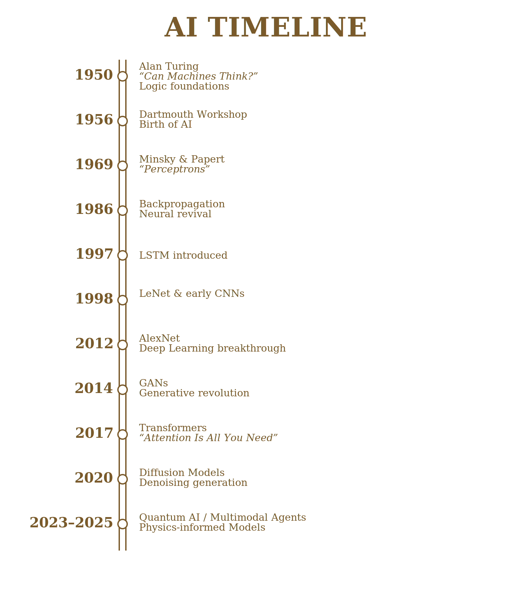
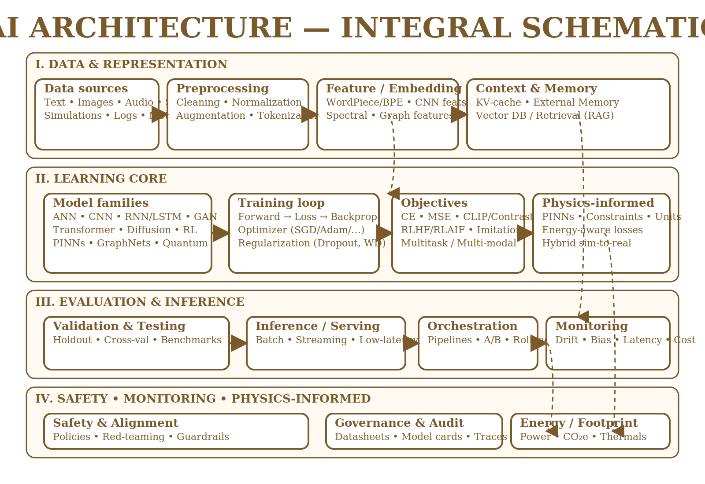

# Artificial Intelligence — Philosophy, Architecture, and Physical Integration

**Author:** S. I. Romanova (2025)  
**Tagline:** The road opens when logic meets light.

## 🧭 Overview
This independent research explores how AI evolves from algorithmic systems into self-organizing, energy-aware cognitive architectures. It connects three threads:

- **Philosophy:** mind, meaning, ethics, agency
- **Architecture:** neural paradigms (ANN, CNN, RNN/LSTM, GAN, Transformer, Diffusion, RL, PINNs, Quantum)
- **Physical integration:** energy, embodiment, resonance, constraints

> Core idea: *from logic to resonance* — computation, energy, and meaning as a single continuum.

## 🧩 Structure

- **Part I — Conceptual Framework & History (1950–2025).**  
  Canonical architectures and milestones; multilevel view of AI as a system (logical, evolutionary, stochastic, physical, philosophical).

- **Part II — Philosophical & Physical Integration.**  
  Information–energy–intent budgets, resonance zone, physics-informed learning (PINNs, units, conservation), safety and governance as structural constraints.

- **Supplement — Regional AI Systems (Russia, 2023–2025).**  
  Public-safe overview of assistant-style, text-to-image, and speech systems.

- **Appendix — AI Timeline (1950–2025).**  
  Visual chronology of key shifts.

---

## 📘 Files

| File | Description |
|------|-------------|
| `report/AI-Philosophy-and-Architecture.pdf` | Camera-ready coursework (Part I, full narrative) |
| `report/Part_II_Philosophy_and_Physics_Romanova_SI.pdf` | Part II — Philosophical & Physical Integration (separate manuscript) |
| `manuscript/AI-Philosophy-and-Architecture.docx` | Working manuscript (Part I source) |
| `manuscript/Part_II_Philosophy_and_Physics_Romanova_SI.docx` | Working manuscript (Part II source) |
| `manuscript/AI_Models_Russia_Romanova_SI.docx` | Supplementary regional overview (Russia, 2023–2025) |
| `figures/AI_Timeline_2col.svg` | Timeline figure (1950–2025, vector) |
| `figures/AI_Timeline_2col_1600.png` | Timeline figure (1950–2025, PNG for DOCX/Slides) |
| `figures/architecture_schematic.svg` | Integral AI architecture schematic (vector) |
| `figures/architecture_schematic_3200.png` | Architecture schematic (PNG for DOCX/Slides) |
| `notebooks/01-timeline-fig.ipynb` | Future work: code to render/update the timeline |
| `notebooks/02-architecture-notes.ipynb` | Future work: notes and citations on architectures |
| `references/references.bib` | Core BibTeX file (key AI references; expandable) |

> Current sources: `AI-Philosophy-and-Architecture.docx` (main text) and `AI-Timeline.docx` (timeline notes); see the `manuscript/` folder.  
> Timeline basis (1950–2025): Turing, Dartmouth, Perceptrons, Backprop, LSTM, LeNet, AlexNet, GANs, Transformers, Diffusion, Quantum / Multimodal.

---

## 🧭 Timeline
  
[Full-quality SVG →](figures/AI_Timeline_2col.svg)

---

## 🧩 Architecture (Integral Schematic)
  
[Full-quality SVG →](figures/architecture_schematic.svg)

---

> The former placeholder *AI_Coursework_Romanova_SI_English.docx* was removed to avoid duplication.

---

## 🗂 Cases (Public-safe Index)

Public-safe index of deliverables. Private notes and drafts remain offline.

| ID    | Title                                   | Artifact (public)                                           | Status             |
|-------|-----------------------------------------|-------------------------------------------------------------|--------------------|
| C-001 | AI Timeline (1950–2025)                 | `figures/AI_Timeline_2col.svg`                              | ✅ done            |
| C-002 | Integral Architecture Schematic         | `figures/architecture_schematic.svg`                        | ✅ done            |
| C-003 | Camera-ready Report (Part I)            | `report/AI-Philosophy-and-Architecture.pdf`                 | ✅ done            |
| C-004 | Regional AI Systems (RU, 2023–2025)     | `manuscript/AI_Models_Russia_Romanova_SI.docx`              | ✅ done (v1)       |
| C-005 | Part II — Philosophy & Physics (v1)     | `manuscript/Part_II_Philosophy_and_Physics_Romanova_SI.docx` | ✅ done (v1, 2025) |

---

## 🔬 Methods (Author’s conceptual framework)

- **Multilevel AI:** Logical (L), Evolutionary (E), Stochastic (S), Physical (P), Philosophical (Φ).  
- **Formal view:**  
  \( \text{AI} = f(L, E, S, P, \Phi) \) and integral axis  
  \( \displaystyle \int_{\Phi} f(L, E, S, P)\, d\Phi \)  
  — mapping micro-processes to macro-awareness.

- **Architectural lens:**  
  ANN / CNN / RNN / LSTM → GAN → Transformer → Diffusion;  
  hybrids: RL, PINNs, neuromorphic, quantum-inspired.

- **Physical alignment:**  
  energy-based constraints, resonance, embodiment; physics-informed residuals in the loss; governance and safety as boundary conditions.

---

## 🔎 Results (snapshot)

- A unified conceptual map of architectures (1950–2025) and their physical / epistemic assumptions.  
- A philosophical synthesis: intelligence as a resonant field linking data, energy, and meaning, with humans as co-learners and intent-setters.  
- Educational demonstration concept: simple neural training with animated loss/accuracy and physics-like constraints for teaching.

---

## 📥 How to use this repo

- Read `report/AI-Philosophy-and-Architecture.pdf` for the full narrative (or the DOCX in `manuscript/`).  
- Use `report/Part_II_Philosophy_and_Physics_Romanova_SI.pdf` for a deeper dive into information–energy–intent budgets and resonance.  
- Refer to `manuscript/AI_Models_Russia_Romanova_SI.docx` for a regional, non-benchmarking overview of Russian AI systems (2023–2025).  
- Use `figures/` when preparing slides or handouts (timeline and architecture diagrams).  
- Once available, run the notebooks in `notebooks/` to regenerate figures and explore architectures programmatically.

---

## 🧾 Citation

Romanova, S. I. (2025). *Artificial Intelligence — Philosophy, Architecture, and Physical Integration.* GitHub repository:  
<https://github.com/SvetLuna-Lab/AI-Philosophy-and-Architecture>

(A LinkedIn post / DOI may be added after official release.)

---

## ✅ Roadmap

**Done**

- Moved DOCX sources to `manuscript/`.  
- Exported camera-ready PDFs to `report/`.  
- Added SVG and PNG versions of the timeline and architecture figures.  
- Added basic `.gitignore`, `LICENSE` (MIT), and `CITATION.cff`.

**Next**

- Add `references/references.bib` (30–40 entries, APA / BibTeX).  
- Add `notebooks/01-timeline-fig.ipynb` and `notebooks/02-architecture-notes.ipynb`.  
- (Optional) Set up lightweight CI to validate notebook execution and basic repo consistency.

---

## 📄 License

**MIT License** (unless institutional requirements dictate otherwise).

---

## 📝 Changelog (digest)

**0.1.1 — 2025-11-02**

- Added: `figures/architecture_schematic.svg` (integral AI diagram).  
- Docs: README update (C-002 marked done; PNG export note).  
- Docs: Inserted figure captions and minimal philosophical section.  
- Refs: created `references/references.bib` placeholder.

> Full history: see `CHANGELOG.md` (if present).

---

© 2025 **S. I. Romanova**. All rights reserved where noted.

